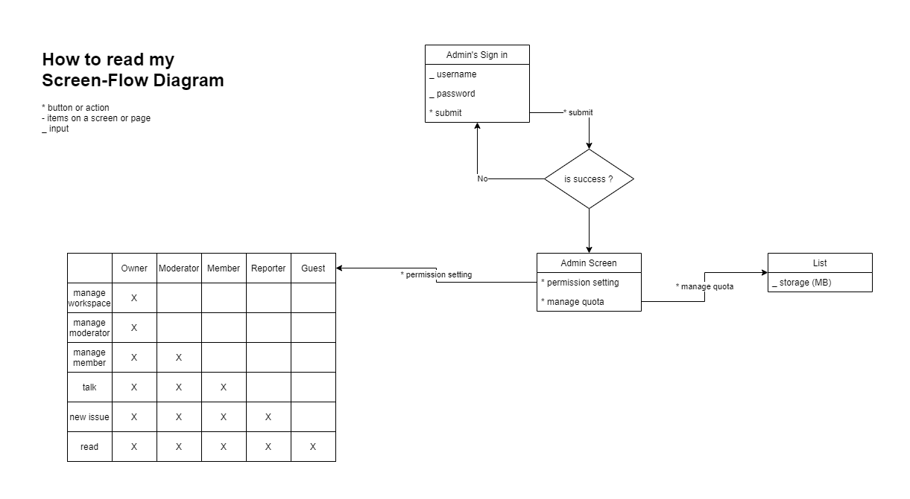
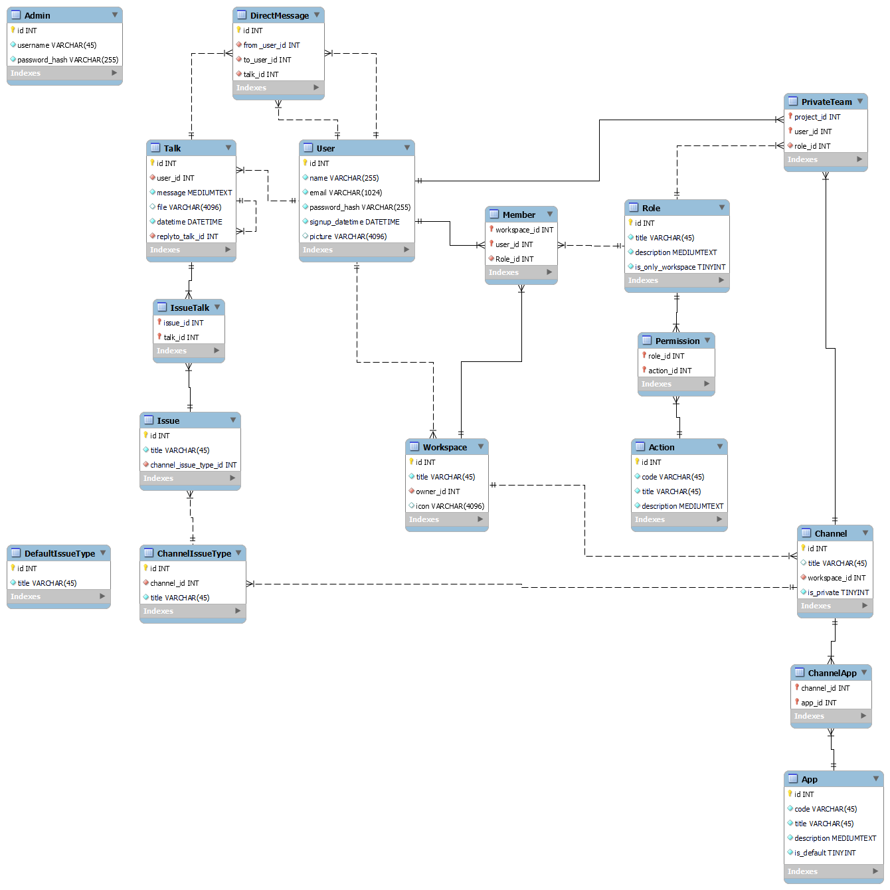

# 🔥 Campfire
Team 💬 collaboration, 📈 monitoring and 🤸 activity management tools

## Applications
1. Backend (developed with Golang)
2. Website (developed with Vue + Tailwind CSS)
3. Mobile App (developed with Flutter)

## Feature for user
- User can create workspaces.
- User can create channels.
- User can choose which app to use in the channel.
- User can set the permissions of the team in the channel.

## Feature for admin
- Admin can set user permissions.
- Admin can assign storage quota to users.

## User screen flow

## Admin screen flow

## EER-Diagram (MySQL Workbench file)
