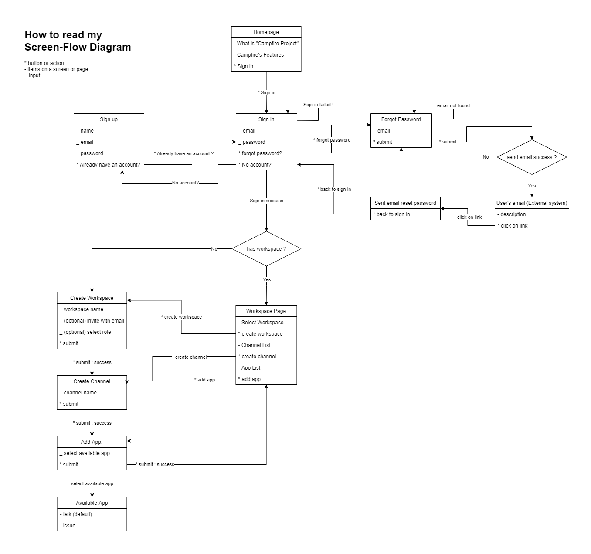

# 🔥 Campfire
Team 💬 collaboration, 📈 monitoring and 🤸 activity management tools

## Applications
1. [Backend (developed with Golang)](https://github.com/golfz/campfire-go)
2. [Website (developed with Vue + Tailwind CSS)](https://github.com/golfz/campfire-website)
3. [Mobile App (developed with Flutter)](https://github.com/golfz/campfire-flutter)

## Feature for user
- User can create workspaces.
- User can create channels.
- User can choose which app to use in the channel.
- User can set the permissions of the team in the channel.

## Feature for admin
- Admin can set user permissions.
- Admin can assign storage quota to users.

## User screen flow

## Admin screen flow

## EER-Diagram (MySQL Workbench file)
